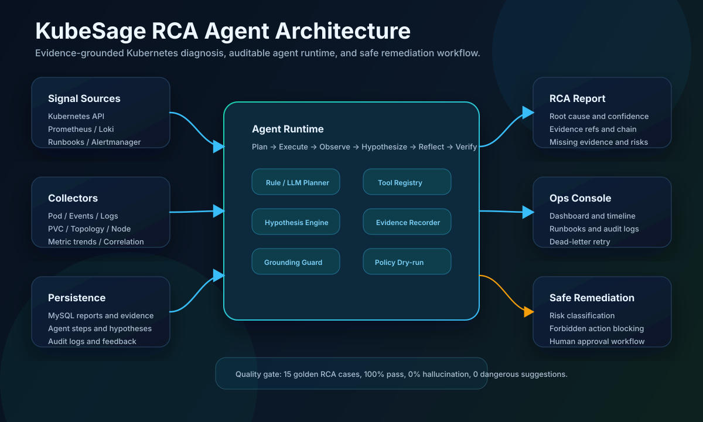

# KubeSage

<p align="center">
  
</p>

KubeSage 是一个面向 Kubernetes Pod 故障的智能根因分析 RCA Agent。它会自动汇聚 Kubernetes API、Prometheus、Loki、Runbook 和告警上下文，用可审计的 Agent Runtime 做证据采集、假设推理、根因判断和安全修复建议。

> 核心定位：不是让 LLM 猜故障，而是让 Agent 基于可追溯证据完成 Kubernetes 故障诊断。

## Highlights

| 能力 | 说明 |
| --- | --- |
| Evidence-grounded RCA | 每个诊断结论都保留 evidence refs、证据链、置信度拆解和缺失证据 |
| Auditable Agent Runtime | 记录 plan、tool call、observation、hypothesis、reflection、verification 全流程 |
| Multi-source diagnosis | 聚合 Pod、Events、previous logs、PVC、拓扑、Node、Prometheus、Loki、Runbook |
| LLM safety guard | 以规则诊断为事实源，加入 grounding 校验、幻觉风险评估和危险建议过滤 |
| Safe remediation | 仅生成可审查建议，支持 dry-run 预览、风险分级、人工审批和禁止动作拦截 |
| Production ops loop | Redis Stream 队列、per-pod 分布式锁、重试、死信、审计日志、Dashboard 和 SLO |

## Architecture



## Supported Faults

| 故障类型 | Analyzer |
| --- | --- |
| `OOMKilled` | `OOMKilledAnalyzer` |
| `CrashLoopBackOff` | `CrashLoopBackOffAnalyzer` |
| `PodPending` | `PendingAnalyzer` |
| `ImagePullBackOff` | `ImagePullBackOffAnalyzer` |
| `ProbeFailed` | `ProbeFailedAnalyzer` |
| `Init:Error` | `InitErrorAnalyzer` |
| `Evicted` | `EvictedAnalyzer` |
| `NodeNotReady` | `NodeNotReadyAnalyzer` |

## How It Works

1. **Trigger**: 手动 API 或 Alertmanager webhook 创建诊断任务，并通过 `namespace/pod` 锁防止重复诊断。
2. **Snapshot**: 采集 Pod 状态、Events、精准时间窗口日志、PVC、拓扑、Node、相关工作负载和指标趋势。
3. **Plan**: Rule Planner 或 LLM Planner 选择只读工具，按 parallel group 执行采集。
4. **Hypothesize**: 假设引擎基于证据权重更新 13 类根因假设。
5. **Ground**: LLM 增强输出必须引用 evidence id，未通过 grounding 校验时自动降级为规则报告。
6. **Report**: 生成结构化 RCA 报告、置信度拆解、缺失证据、风险提示和验证计划。
7. **Operate**: Dashboard、审计日志、Runbook 管理、审批队列、死信重试形成运维闭环。

## Tech Stack

| Layer | Stack |
| --- | --- |
| Backend | Go, Gin, client-go, GORM, Viper, Zap |
| Frontend | React 18, TypeScript, Ant Design 5, Vite, TanStack Query |
| Storage | MySQL, Redis, Qdrant optional vector store |
| Observability | Prometheus metrics, OpenTelemetry tracing, Loki logs |
| Agent Extensions | MCP tools, OpenAI-compatible LLM, Runbook RAG |
| Deployment | Docker Compose, Helm, Kubernetes manifests, distroless image |

## Quick Start

### 1. Start MySQL

```bash
docker compose -f deployments/docker-compose.yaml --profile mysql up -d
```

### 2. Configure Kubernetes Access

```yaml
kubernetes:
  kubeconfig: "~/.kube/config"
```

KubeSage 只需要只读 RBAC：Pods、Pod logs、Events、Services、Endpoints、EndpointSlices、Nodes、ReplicaSets、Deployments、PersistentVolumeClaims。

### 3. Run Backend

```bash
go mod tidy
go run ./cmd/server
```

Health checks:

```bash
curl http://127.0.0.1:8080/healthz
curl http://127.0.0.1:8080/readyz
curl http://127.0.0.1:8080/metrics
```

### 4. Run Frontend

```bash
cd web
npm install
npm run dev
```

The Vite dev server runs on port `5173` and proxies API requests to the backend.

## Configuration

Main configuration lives in [configs/config.yaml](configs/config.yaml).

```yaml
agent:
  enabled: true
  max_steps: 12
  tool_timeout_seconds: 10
  enable_dry_run_preview: true

planner:
  type: "llm" # "llm" or "rule"

diagnosis:
  task_timeout_seconds: 60
  log_window_before_seconds: 120
  log_window_after_seconds: 60
  pod_lock_ttl_seconds: 300
```

Sensitive values should be injected through environment variables:

```bash
export KUBESAGE_SERVER_AUTH_TOKEN=change-me
export KUBESAGE_MYSQL_PASSWORD=kubesage
export KUBESAGE_LLM_ENABLED=true
export KUBESAGE_LLM_API_KEY=sk-...
```

## Agent Runtime

Agent Runtime is enabled by default. When `agent.enabled=false`, diagnosis falls back to the legacy snapshot + rule analyzer + LLM summary path.

The runtime records every planning decision, tool call, observation, hypothesis update, remediation policy decision, and verification plan into:

- `agent_steps`
- `hypotheses`
- `remediation_executions`
- `diagnosis_reports.agent_execution_summary`
- `diagnosis_reports.agent_report_snapshot`

Stop conditions include `max_steps`, `confirmed_hypothesis`, `timeout`, `no_effective_tool`, `critical_tool_failed`, `plan_complete`, and `llm_reflection_complete`.

## Built-in Tools

| Tool | Purpose |
| --- | --- |
| `k8s.get_pod` | Pod detail snapshot |
| `k8s.get_events` | Related Kubernetes Events |
| `k8s.get_logs` | Current and previous logs with time window support |
| `k8s.get_topology` | Deployment, Service, EndpointSlice, sibling pods, Node |
| `k8s.get_pvc` | PVC, PV, StorageClass state |
| `runbook.search` | Keyword and vector Runbook retrieval |
| `prometheus.query_range` | Metric trends around fault time |
| `loki.query_logs` | Cluster log query |
| `remediation.generate_actions` | Safe action proposal generation |
| `remediation.dry_run` | Policy-only dry-run preview |

MCP tools can be registered with `mcp.<server>.<tool>` names and participate in the same planning flow.

## LLM Grounding

KubeSage supports OpenAI-compatible APIs, with DeepSeek-style configuration by default.

```yaml
llm:
  enabled: false
  base_url: "https://api.deepseek.com"
  model: "deepseek-chat"
  grounding:
    enabled: true
    semantic_min_overlap: 0.3
    pass_risk_threshold: 0.2
    warning_risk_threshold: 0.3
    reject_risk_threshold: 0.4
```

LLM output is treated as an enhancement layer, not the source of truth. The rule engine result remains authoritative, and the grounding pipeline checks:

- whether evidence references exist
- whether claims overlap with referenced evidence
- whether the LLM agrees with the rule diagnosis
- whether hallucination risk crosses fallback thresholds
- whether suggested actions contain dangerous commands

## Safe Remediation

KubeSage MVP is validation-only: it does not execute real cluster mutations.

| Risk | Behavior |
| --- | --- |
| Low | Read-only suggestions, auto-approved |
| Medium | Requires human approval, command preview uses dry-run style |
| High | Proposal only, must be manually confirmed |
| Forbidden | Always blocked, including destructive namespace, PVC, database, or scale-to-zero actions |

## API Examples

Trigger a diagnosis:

```bash
curl -X POST http://127.0.0.1:8080/api/v1/diagnose/pod \
  -H "Content-Type: application/json" \
  -H "Authorization: Bearer change-me" \
  -d '{
    "namespace": "default",
    "pod_name": "example-pod",
    "include_logs": true,
    "include_events": true,
    "include_metrics": true,
    "alert_time": "2026-05-29T10:00:00+08:00"
  }'
```

Query task details:

```bash
curl -H "Authorization: Bearer change-me" \
  http://127.0.0.1:8080/api/v1/diagnose/tasks/1
```

Core API groups:

| Route | Purpose |
| --- | --- |
| `POST /api/v1/diagnose/pod` | Start Pod diagnosis |
| `GET /api/v1/diagnose/tasks` | List diagnosis tasks |
| `GET /api/v1/diagnose/tasks/:id` | Get report, evidence, hypotheses, timeline |
| `POST /api/v1/alertmanager/webhook` | Receive Alertmanager alerts |
| `GET /api/v1/dashboard/*` | Operational metrics and trends |
| `GET /api/v1/runbooks` | Runbook management |
| `GET /api/v1/audit-logs` | Audit log query |
| `GET /api/v1/dead-letters` | Queue dead-letter query |
| `POST /api/v1/dead-letters/:id/retry` | Retry failed diagnosis |
| `GET /api/v1/remediation/pending` | Remediation proposals waiting for manual acknowledgement |
| `POST /api/v1/remediation/:id/approve` | Acknowledge proposal for manual handling; no automated dry-run/execution |
| `POST /api/v1/remediation/:id/reject` | Reject remediation proposal |

OpenAPI spec: [docs/openapi.yaml](docs/openapi.yaml)

## Evaluation

KubeSage includes a reproducible RCA evaluation CLI.

```bash
go run ./cmd/rca-eval run \
  --cases eval/cases \
  --out eval-results.json \
  --summary eval-results.md
```

Current `eval/cases` contains 15 golden cases:

| Category | Cases |
| --- | ---: |
| OOMKilled | 4 |
| CrashLoopBackOff | 4 |
| PodPending | 3 |
| ImagePullBackOff | 2 |
| ProbeFailed | 2 |

Quality gates include RCA accuracy, fault type accuracy, root cause accuracy, hallucination rate, overconfidence, safety, and latency. The checked-in summary reports 15/15 passed with 100% RCA accuracy and 0% hallucination rate.

## Deployment

Build image:

```bash
docker build -t kubesage:latest .
```

Run full stack with Docker Compose:

```bash
docker compose up -d
```

Deploy with Helm:

```bash
helm install kubesage deployments/helm/kubesage \
  -n kubesage \
  --create-namespace
```

Helm values: [deployments/helm/kubesage/values.yaml](deployments/helm/kubesage/values.yaml)

## Project Structure

```text
cmd/
  server/                  HTTP service entrypoint
  rca-eval/                RCA evaluation CLI
configs/                   Runtime configuration
internal/
  agent/                   Agent runtime, planner, tools, hypotheses, remediation policy
  alertmanager/            Alertmanager webhook parser and mapper
  api/                     Gin router, handlers, auth, RBAC, audit middleware
  config/                  Viper config loader and validation
  db/                      MySQL, Redis, migration management
  diagnostic/              Rule engine and analyzers
  eval/                    Case loader, runner, scorer, reporter
  k8s/                     Kubernetes collectors
  llm/                     LLM client, planner, grounding validator
  loki/                    Loki query client
  model/                   GORM models
  observability/           Prometheus metrics and OpenTelemetry tracing
  prometheus/              Prometheus HTTP API client
  rag/                     Runbook keyword and vector retrieval
  repository/              Persistence layer
  resilience/              Retry and backoff helpers
  service/                 Diagnosis, snapshot, operations, queue, notification logic
web/                       React + TypeScript frontend
eval/                      Golden RCA cases and fixtures
deployments/               Docker Compose, Helm, Kubernetes manifests
migrations/                SQL migrations
runbooks/                  Fault runbooks
docs/                      OpenAPI, SLO, demo docs, README assets
```

## Useful Commands

```bash
go test ./...
npm --prefix web run build
go run ./cmd/rca-eval run --cases eval/cases --out eval-results.json --summary eval-results.md
```

## Docs

- Demo script: [docs/DEMO.md](docs/DEMO.md)
- SLO: [docs/SLO.md](docs/SLO.md)
- OpenAPI: [docs/openapi.yaml](docs/openapi.yaml)
- Built-in runbooks: [runbooks](runbooks)
